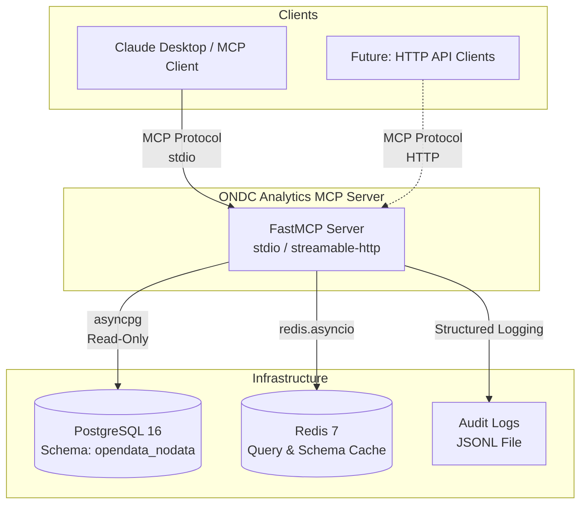
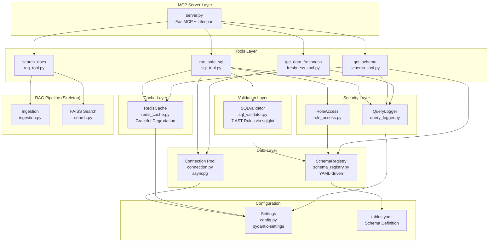
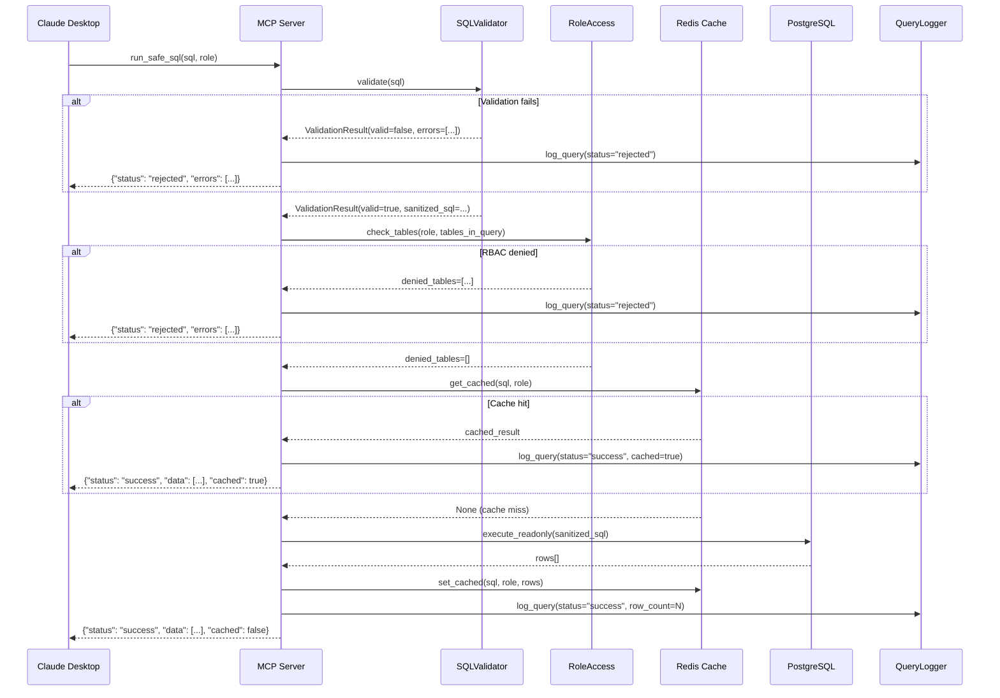
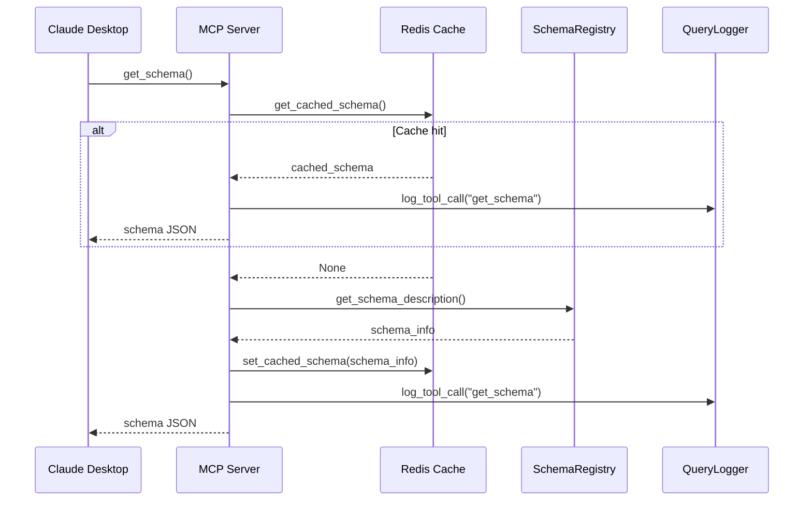
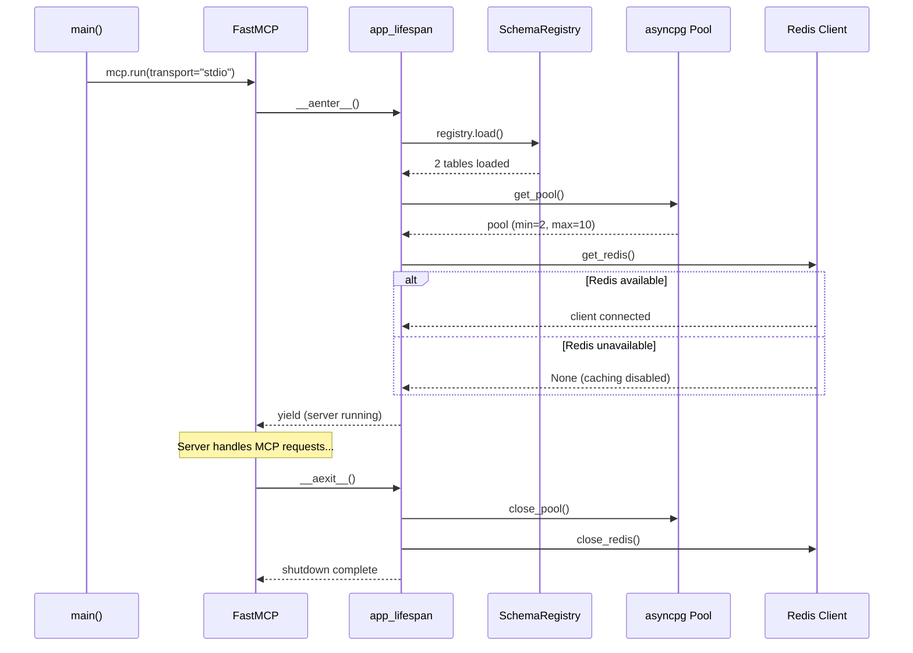
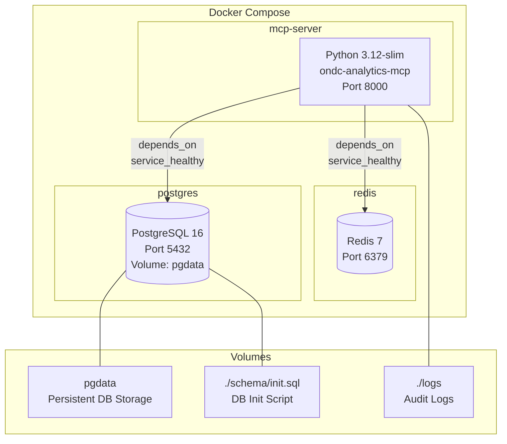

# ONDC Analytics MCP Server — High-Level Design & System Architecture

| Field       | Value                                                        |
|-------------|--------------------------------------------------------------|
| **Version** | 1.0                                                          |
| **Date**    | 2026-02-10                                                   |
| **Author**  | ONDC Analytics Team                                          |
| **Status**  | Draft                                                        |

---

## Table of Contents

1. [Executive Summary](#1-executive-summary)
2. [Business Context & Use Cases](#2-business-context--use-cases)
3. [High-Level Architecture (HLD)](#3-high-level-architecture-hld)
4. [Component Deep-Dive](#4-component-deep-dive)
5. [Data Model](#5-data-model)
6. [Data Flow & Sequence Diagrams](#6-data-flow--sequence-diagrams)
7. [Security Architecture](#7-security-architecture)
8. [Deployment Architecture](#8-deployment-architecture)
9. [Configuration Reference](#9-configuration-reference)
10. [Testing & Quality](#10-testing--quality)
11. [Performance Characteristics](#11-performance-characteristics)
12. [Future Roadmap](#12-future-roadmap)
13. [Appendix](#13-appendix)

---

## 1. Executive Summary

**ONDC Analytics MCP Server** is a governed Model Context Protocol (MCP) server that enables conversational analytics over ONDC (Open Network for Digital Commerce) e-commerce transaction data stored in PostgreSQL. It allows AI assistants like Claude Desktop to answer business questions about order volumes, network participant activity, and geographic distribution — while enforcing strict SQL safety guardrails, role-based access control, and a full audit trail.

**Key value propositions:**

- **Conversational analytics** — Business users ask natural-language questions; the LLM translates them to validated SQL via MCP tools.
- **SQL safety guardrails** — A 7-rule validation engine using AST parsing (sqlglot) blocks injection, DDL, full-table scans, and Cartesian joins before any query reaches the database.
- **Audit trail** — Every query attempt (accepted, rejected, or errored) is logged as structured JSONL with timestamps, roles, and execution metrics.
- **Role-based access** — Table-level RBAC ensures viewers and analysts see only what they should.

**Tech stack:** Python 3.12 · FastMCP · asyncpg · sqlglot · pydantic-settings · Redis · PostgreSQL 16

**Current status:** 37 tests passing, 4 MCP tools operational, 2 analytics tables loaded, ~1,585 LOC across 22 files.

---

## 2. Business Context & Use Cases

### 2.1 What is ONDC?

ONDC (Open Network for Digital Commerce) is India's government-backed initiative to democratize digital commerce. It creates an open, interoperable network where buyer applications and seller applications from different providers can transact — removing platform lock-in and enabling a level playing field across domains.

### 2.2 Why Analytics Matter

Understanding order patterns, network participant behaviour, and geographic distribution across ONDC's diverse domains is critical for:

- **Policymakers** — tracking network adoption and identifying underserved regions
- **Network participants** — benchmarking performance against peers
- **Ecosystem builders** — identifying growth opportunities across domains

### 2.3 Business Domains Covered

The system covers **8 ONDC business domains** with their sub-categories:

| Domain | Categories |
|--------|-----------|
| **Retail B2C** | Agriculture, Appliances, Auto Components & Accessories, BPC, Electronics, Fashion, F&B, Grocery, Health & Wellness, Home & Kitchen, Others |
| **Retail B2B** | B2B |
| **Finance** | Mutual Fund, Personal Loan |
| **Logistics** | BPC, Electronics, Fashion, F&B, Grocery, Health & Wellness, Home & Kitchen, Hyperlocal, Intercity |
| **Home Services** | Appliance Repair Services, Infra Services, Personal Care Services |
| **Public Transport** | Bus, Metro |
| **Ride Hailing** | Cabs/Auto |
| **Retail Voucher** | Gift Card |

### 2.4 Example Analytics Questions

The system is designed to answer questions such as:

- *"How many Retail B2C orders were placed in January 2025?"*
- *"Which buyer NPs had the most Grocery orders last week?"*
- *"Compare Inter NP vs Intra NP order volumes for Finance domain in Q1."*
- *"What are the top delivery cities for Logistics orders?"*
- *"Show daily order trends for Ride Hailing in Hyderabad."*

### 2.5 Target Users

| Role | Access | Use Case |
|------|--------|----------|
| **Analyst** | Both tables | Full analytics queries across all dimensions |
| **Viewer** | Domain-level table only | Summary views without city-level data |
| **LLM Dashboards** | Via MCP protocol | Automated conversational analytics |

---

## 3. High-Level Architecture (HLD)

### 3.1 System Context Diagram



### 3.2 Component Architecture Diagram



### 3.3 Component Summary

| Component | File | Purpose |
|-----------|------|---------|
| MCP Server | `server.py` | FastMCP entry point, tool registration, lifecycle management |
| SQL Tool | `tools/sql_tool.py` | Orchestrates validation → RBAC → cache → execute → audit |
| Schema Tool | `tools/schema_tool.py` | Returns cached table metadata for LLM context |
| Freshness Tool | `tools/freshness_tool.py` | Checks latest data date per table |
| RAG Tool | `tools/rag_tool.py` | Document search skeleton |
| SQL Validator | `validation/sql_validator.py` | 7-rule AST validation engine using sqlglot |
| Role Access | `security/role_access.py` | Table-level RBAC check |
| Query Logger | `security/query_logger.py` | Structured JSONL audit logging |
| Connection Pool | `db/connection.py` | asyncpg pool with read-only enforcement |
| Schema Registry | `db/schema_registry.py` | YAML-driven table metadata loader |
| Redis Cache | `cache/redis_cache.py` | Query and schema caching with graceful degradation |
| Settings | `config.py` | Environment-based configuration via pydantic-settings |

---

## 4. Component Deep-Dive

### 4.1 MCP Server Layer (`server.py` — 159 lines)

The server is built on **FastMCP**, the official Python framework for the Model Context Protocol. It provides:

- **Lifespan management** — An async context manager (`app_lifespan`) that initializes the schema registry, database pool, and Redis connection on startup, and cleans them up on shutdown.
- **Tool registration** — Four tools registered via `@mcp.tool()` decorators, each with rich docstrings that guide the LLM on usage patterns.
- **Transport** — Currently runs in `stdio` mode for Claude Desktop integration. HTTP transport is prepared but commented out for future use.

```python
mcp = FastMCP(
    "ONDC Analytics",
    lifespan=app_lifespan,
    host=settings.host,
    port=settings.port,
)
```

### 4.2 Tools Layer

Four MCP tools are exposed to the LLM client:

#### `run_safe_sql(sql, role="analyst")` — Primary query tool

The most critical tool. Accepts raw SQL from the LLM, runs it through the full validation → RBAC → cache → execute → audit pipeline, and returns JSON results. The tool docstring explicitly tells the LLM which tables exist, what columns are available, and what validation rules are enforced — preventing hallucinated table names.

#### `get_schema()` — Schema discovery

Returns full schema metadata (table names, column names and types, domain/category mappings, NP types). Designed to be called **before** any SQL query to give the LLM accurate context. Results are cached in Redis with a 1-hour TTL.

#### `get_data_freshness()` — Data recency check

Queries `MAX(order_date)` from each table so the LLM knows the latest available data date. Useful for answering "how recent is the data?" and for constructing date filters.

#### `search_docs(query)` — Document search (skeleton)

A placeholder for future RAG-based document search. Currently returns an empty result set with a message indicating no documents are indexed.

### 4.3 SQL Validation Engine (`sql_validator.py` — 197 lines)

The core security component. Uses **sqlglot** to parse SQL into an Abstract Syntax Tree (AST) and enforces 7 validation rules:

| # | Rule | What It Blocks | Implementation |
|---|------|---------------|----------------|
| 1 | **SELECT-only** | INSERT, UPDATE, DELETE, DROP, ALTER, CREATE | Checks `isinstance(statement, exp.Select)` |
| 2 | **Single statement** | Multi-statement injection (`SELECT 1; DROP TABLE...`) | Checks `len(parsed) > 1` |
| 3 | **No SELECT \*** | Full-table column exposure | Scans AST for `exp.Star` nodes |
| 4 | **Allowed tables only** | Access to system tables, PII tables | Cross-references tables against `SchemaRegistry` |
| 5 | **Date filter required** | Full-table scans without time bounds | Checks `WHERE` clause for `order_date` column reference |
| 6 | **Join validation** | Cartesian joins, joins on non-indexed columns | Requires `ON` clause; restricts join columns to allowed list |
| 7 | **LIMIT enforcement** | Unbounded result sets | Auto-injects `LIMIT 1000`; caps user-specified limits exceeding max |

The validator returns a `ValidationResult` dataclass containing:
- `valid: bool` — whether the query passed all rules
- `errors: list[str]` — human-readable rejection reasons
- `sanitized_sql: str` — the query with LIMIT enforced (only set if valid)

### 4.4 Security & Access Control

#### RBAC (`role_access.py` — 32 lines)

Table-level role-based access control driven by the schema configuration:

| Role | Allowed Tables |
|------|---------------|
| `analyst` | `model_for_all_domain`, `model_for_all_domain_pincode` |
| `viewer` | `model_for_all_domain` only |
| Unknown roles | All tables (graceful fallback) |

The `RoleAccess` class provides three methods:
- `get_allowed_tables(role)` — list of accessible tables
- `can_access_table(role, table_name)` — boolean check
- `check_tables(role, table_names)` — returns denied tables from a list

#### Audit Logging (`query_logger.py` — 85 lines)

Every interaction is logged as structured JSONL to `logs/audit.jsonl`:

**Query log entry fields:**
```json
{
  "timestamp": "2025-01-15T10:30:00.000Z",
  "user_id": "anonymous",
  "role": "analyst",
  "raw_sql": "SELECT domain, SUM(orders) FROM ...",
  "validated_sql": "SELECT domain, SUM(orders) FROM ... LIMIT 1000",
  "status": "success",
  "rejection_reasons": [],
  "execution_time_ms": 45.2,
  "row_count": 8,
  "error_message": null
}
```

**Tool call log entry fields:**
```json
{
  "timestamp": "2025-01-15T10:30:00.000Z",
  "event": "tool_call",
  "tool_name": "get_schema",
  "user_id": "anonymous",
  "args": {},
  "status": "success",
  "execution_time_ms": 12.1
}
```

The logger uses a graceful degradation pattern — if the filesystem is read-only, it falls back to stderr logging.

### 4.5 Database Layer

#### Connection Pool (`connection.py` — 43 lines)

Manages an **asyncpg** connection pool with:
- **Pool sizing** — min 2, max 10 connections
- **Read-only enforcement** — Every query runs within `SET TRANSACTION READ ONLY`
- **Statement timeout** — Configurable per-query timeout (default 30 seconds) via `SET statement_timeout`
- **Singleton pattern** — Pool is created once and reused

```python
async def execute_readonly(sql: str, timeout: float | None = None) -> list[dict]:
    pool = await get_pool()
    async with pool.acquire() as conn:
        await conn.execute("SET TRANSACTION READ ONLY")
        await conn.execute(f"SET statement_timeout = '{int(effective_timeout * 1000)}'")
        rows = await conn.fetch(sql)
        return [dict(row) for row in rows]
```

#### Schema Registry (`schema_registry.py` — 101 lines)

Loads table metadata from `schema/tables.yaml` and provides typed lookups:

- `schema_name` — PostgreSQL schema (`opendata_nodata`)
- `tables` — Table definitions with columns, types, descriptions
- `domain_categories` — Valid domain-to-category mappings
- `np_types` — Valid network participant types
- `roles` — Role-to-table access mappings
- `get_allowed_join_columns(table)` — Columns permitted in JOIN ON clauses
- `requires_date_filter(table)` — Whether a table requires order_date in WHERE

### 4.6 Cache Layer (`redis_cache.py` — 102 lines)

Redis-based caching with **graceful degradation** — if Redis is unavailable, the system continues without caching.

| Cache Type | Key Pattern | TTL | Purpose |
|-----------|-------------|-----|---------|
| Query results | `ondc_mcp:query:<sha256_16>` | 5 min (300s) | Avoid re-executing identical queries |
| Schema metadata | `ondc_mcp:schema` | 1 hour (3600s) | Cache schema description for LLM |

Key design decisions:
- **SHA-256 cache keys** — Queries are hashed with the role to prevent cross-role cache hits
- **Silent failure** — All cache operations catch exceptions and log warnings, never breaking the query flow
- **Configurable TTLs** — Via `cache_query_ttl` and `cache_schema_ttl` settings

### 4.7 RAG Pipeline (Skeleton)

The system includes a skeleton RAG (Retrieval-Augmented Generation) pipeline for future document search:

- **Ingestion** (`rag/ingestion.py` — 62 lines) — `chunk_text()` splits documents into overlapping chunks (500 chars, 50 overlap). `load_documents()` reads `.md` and `.txt` files. `ingest_to_faiss()` raises `NotImplementedError` pending `faiss-cpu` + `sentence-transformers` installation.
- **Search** (`rag/search.py` — 24 lines) — `search_faiss()` raises `NotImplementedError` pending dependency installation.
- **Dependencies** — Defined as optional Poetry group: `poetry install --with rag`

---

## 5. Data Model

### 5.1 Schema: `opendata_nodata`

All tables reside in the PostgreSQL schema `opendata_nodata`.

### 5.2 Table: `model_for_all_domain`

Order counts aggregated by domain, category, and network participant.

| Column | Type | Description |
|--------|------|-------------|
| `order_date` | `date` | Order date (NOT NULL, required in WHERE) |
| `domain` | `varchar` | Business domain (Retail B2C, Finance, Logistics, etc.) |
| `category` | `varchar` | Product/service category within the domain |
| `buyer_np` | `varchar` | Buyer network participant name |
| `seller_np` | `varchar` | Seller network participant name |
| `np_type` | `varchar` | Network participant type: "Inter NP", "Intra NP", or NULL |
| `orders` | `int4` | Number of orders |

**Allowed join columns:** `order_date`, `domain`

### 5.3 Table: `model_for_all_domain_pincode`

Order counts aggregated by domain and geographic location.

| Column | Type | Description |
|--------|------|-------------|
| `order_date` | `date` | Order date (NOT NULL, required in WHERE) |
| `domain` | `varchar` | Business domain |
| `delivery_city` | `varchar` | City where order is delivered |
| `seller_city` | `varchar` | City where seller is located |
| `orders` | `int8` | Number of orders |

**Allowed join columns:** `order_date`, `domain`

### 5.4 Domain-Category Mappings

```
Finance         → Mutual Fund, Personal Loan
Home Services   → Appliance Repair Services, Infra Services, Personal Care Services
Logistics       → BPC, Electronics, Fashion, F&B, Grocery, Health & Wellness,
                  Home & Kitchen, Hyperlocal, Intercity
Public Transport→ Bus, Metro
Retail B2B      → B2B
Retail B2C      → Agriculture, Appliances, Auto Components & Accessories, BPC,
                  Electronics, Fashion, F&B, Grocery, Health & Wellness,
                  Home & Kitchen, Others
Retail Voucher  → Gift Card
Ride Hailing    → Cabs/Auto
```

### 5.5 Network Participant Types

- **Inter NP** — Orders between different buyer and seller network participants
- **Intra NP** — Orders within the same network participant

---

## 6. Data Flow & Sequence Diagrams

### 6.1 `run_safe_sql` — Full Query Execution Flow



### 6.2 `get_schema` — Schema Discovery Flow



### 6.3 Server Startup Lifecycle



---

## 7. Security Architecture

### 7.1 Defense-in-Depth

The system implements multiple overlapping security layers:

| Layer | Control | Component | Purpose |
|-------|---------|-----------|---------|
| 1 | **AST Parsing** | sqlglot | Parse SQL into typed AST — reject unparseable input |
| 2 | **Statement Type Check** | SQLValidator | Only SELECT allowed — blocks INSERT/UPDATE/DELETE/DDL |
| 3 | **Multi-Statement Block** | SQLValidator | Prevents SQL injection via statement chaining |
| 4 | **Column Selection Control** | SQLValidator | No SELECT * — forces explicit column enumeration |
| 5 | **Table Allowlisting** | SQLValidator + SchemaRegistry | Only registered tables accessible |
| 6 | **Date Filter Requirement** | SQLValidator | Prevents unbounded full-table scans |
| 7 | **Join Control** | SQLValidator | ON clause required; only allowed join columns |
| 8 | **Row Limit Enforcement** | SQLValidator | Auto-inject/cap LIMIT at 1000 rows |
| 9 | **Role-Based Access** | RoleAccess | Table-level access per role |
| 10 | **Read-Only Transaction** | connection.py | `SET TRANSACTION READ ONLY` at database level |
| 11 | **Statement Timeout** | connection.py | 30-second query timeout prevents resource exhaustion |

### 7.2 SQL Validation Rules Summary

| Rule | Input | Outcome |
|------|-------|---------|
| `SELECT domain FROM model_for_all_domain WHERE order_date = '2025-01-01'` | Valid SELECT with date filter | Accepted, LIMIT 1000 auto-injected |
| `INSERT INTO model_for_all_domain VALUES (...)` | Non-SELECT statement | Rejected: "Only SELECT statements are allowed" |
| `SELECT * FROM model_for_all_domain WHERE order_date = '2025-01-01'` | SELECT * usage | Rejected: "SELECT * is not allowed" |
| `SELECT domain FROM users WHERE order_date = '2025-01-01'` | Unknown table | Rejected: "Table 'users' is not allowed" |
| `SELECT domain FROM model_for_all_domain` | Missing date filter | Rejected: "WHERE clause with order_date filter is required" |
| `SELECT 1; DROP TABLE model_for_all_domain` | Multi-statement | Rejected: "Only single SQL statements are allowed" |
| `SELECT ... LIMIT 99999` | Excessive limit | Accepted with LIMIT capped to 1000 |

### 7.3 RBAC Model

```
┌─────────────────────────────────────────────────┐
│                  Schema Config                   │
│              (schema/tables.yaml)                │
│                                                  │
│  roles:                                          │
│    analyst:                                      │
│      allowed_tables:                             │
│        - model_for_all_domain                    │
│        - model_for_all_domain_pincode            │
│    viewer:                                       │
│      allowed_tables:                             │
│        - model_for_all_domain                    │
└─────────────────────────────────────────────────┘
                        │
                        ▼
┌─────────────────────────────────────────────────┐
│              RoleAccess.check_tables()           │
│                                                  │
│  Input:  role="viewer",                          │
│          tables=["model_for_all_domain_pincode"] │
│  Output: denied=["model_for_all_domain_pincode"] │
└─────────────────────────────────────────────────┘
```

### 7.4 Attack Scenarios & Mitigations

| Attack Vector | Example | Mitigation |
|---------------|---------|------------|
| **SQL Injection** | `SELECT 1; DROP TABLE x` | Multi-statement block + AST-level parsing (not string matching) |
| **DDL Execution** | `DROP TABLE`, `ALTER TABLE` | Statement type check rejects non-SELECT |
| **Data Exfiltration** | `SELECT * FROM ...` | No SELECT *, explicit columns required |
| **Full-Table Scan** | `SELECT domain FROM t` (no WHERE) | Date filter requirement |
| **Resource Exhaustion** | `SELECT ... LIMIT 999999` or long-running query | LIMIT cap (1000) + statement timeout (30s) |
| **Cartesian Join** | `SELECT ... FROM a, b` (no ON) | Join validation requires ON clause |
| **Unauthorized Table Access** | Querying city data as viewer | RBAC table-level check |
| **Cross-Role Cache Poisoning** | Shared cache across roles | Cache key includes role: `sha256(role:sql)` |

---

## 8. Deployment Architecture

### 8.1 Docker Compose Stack



### 8.2 Claude Desktop Integration

To use with Claude Desktop, add this to `claude_desktop_config.json`:

```json
{
  "mcpServers": {
    "ondc-analytics": {
      "command": "poetry",
      "args": ["--directory", "/path/to/ondc-analytics-mcp", "run", "ondc-mcp"],
      "env": {
        "DATABASE_HOST": "localhost",
        "DATABASE_PORT": "5432",
        "DATABASE_NAME": "ondc_analytics",
        "DATABASE_USER": "ondc",
        "DATABASE_PASSWORD": "ondc_secret"
      }
    }
  }
}
```

### 8.3 Local Development Setup

```bash
# 1. Start infrastructure
docker compose up -d postgres redis

# 2. Install dependencies
poetry install

# 3. Run tests (no infrastructure required)
poetry run pytest

# 4. Run the MCP server
poetry run ondc-mcp
```

### 8.4 Environment Variables Reference

| Variable | Default | Description |
|----------|---------|-------------|
| `DATABASE_HOST` | `localhost` | PostgreSQL host |
| `DATABASE_PORT` | `5432` | PostgreSQL port |
| `DATABASE_NAME` | `ondc_analytics` | Database name |
| `DATABASE_USER` | `ondc` | Database username |
| `DATABASE_PASSWORD` | `ondc_secret` | Database password |
| `DATABASE_SCHEMA` | `opendata_nodata` | PostgreSQL schema |
| `DATABASE_URL` | *(auto-built)* | Full connection URL (overrides individual vars) |
| `REDIS_URL` | `redis://localhost:6379/0` | Redis connection URL |
| `REDIS_ENABLED` | `true` | Enable/disable Redis caching |
| `TRANSPORT` | `stdio` | MCP transport mode: `stdio` or `http` |
| `HOST` | `0.0.0.0` | HTTP server bind address |
| `PORT` | `8000` | HTTP server port |
| `MAX_QUERY_ROWS` | `1000` | Maximum rows per query |
| `QUERY_TIMEOUT_SECONDS` | `30` | SQL statement timeout (seconds) |
| `LOG_LEVEL` | `INFO` | Logging level |
| `AUDIT_LOG_PATH` | `logs/audit.jsonl` | Path for audit log file |
| `CACHE_QUERY_TTL` | `300` | Query cache TTL (seconds) |
| `CACHE_SCHEMA_TTL` | `3600` | Schema cache TTL (seconds) |

---

## 9. Configuration Reference

### 9.1 Application Settings (`config.py`)

All settings are managed via `pydantic-settings` with support for `.env` files and environment variables. The `database_url` is automatically composed from individual database variables if not explicitly set.

### 9.2 Schema Configuration (`tables.yaml`)

```yaml
schema: opendata_nodata          # PostgreSQL schema name

tables:
  model_for_all_domain:
    description: "..."           # Human-readable description
    date_column: order_date      # Column used for date filtering
    require_date_filter: true    # Whether WHERE must include this column
    columns:
      column_name:
        type: varchar            # PostgreSQL type
        description: "..."       # Column description for LLM context
    allowed_join_columns:        # Columns permitted in JOIN ON clauses
      - order_date
      - domain

domain_categories:               # Valid domain → category mappings
  "Retail B2C": [...]

np_types: ["Inter NP", "Intra NP"]  # Valid NP type values

roles:                           # RBAC configuration
  analyst:
    allowed_tables: [...]
  viewer:
    allowed_tables: [...]
```

### 9.3 Cache TTL Strategy

| Data Type | TTL | Rationale |
|-----------|-----|-----------|
| Query results | 5 minutes | Balance between freshness and DB load |
| Schema metadata | 1 hour | Schema changes infrequently; LLM asks often |

---

## 10. Testing & Quality

### 10.1 Test Summary

| Metric | Value |
|--------|-------|
| **Total tests** | 37 |
| **Test files** | 2 (`test_sql_validator.py`, `test_tools.py`) |
| **Test classes** | 11 |
| **Infrastructure required** | None (pure unit tests) |
| **Framework** | pytest + pytest-asyncio |

### 10.2 Test Categories

| Test Class | Tests | What It Covers |
|------------|-------|---------------|
| `TestSelectOnly` | 5 | SELECT, INSERT, UPDATE, DELETE, DROP rejection |
| `TestNoSelectStar` | 2 | SELECT * blocked, explicit columns allowed |
| `TestDateFilter` | 4 | Missing date, equality, range, BETWEEN filters |
| `TestTableAccess` | 2 | Allowed and disallowed table validation |
| `TestLimitEnforcement` | 3 | Auto-inject, preserve existing, cap excessive limits |
| `TestJoinValidation` | 3 | Allowed join, missing ON, disallowed join columns |
| `TestMultiStatement` | 1 | Multi-statement injection prevention |
| `TestMalformed` | 2 | Empty SQL, non-SQL input |
| `TestSchemaRegistry` | 9 | Table loading, schema name, domains, NP types, joins |
| `TestRoleAccess` | 5 | Analyst/viewer/unknown roles, denied/allowed tables |
| `TestSearchDocs` | 1 | RAG skeleton returns empty results |

### 10.3 Test Design

Tests require **no database or Redis** — they use the `SchemaRegistry` loaded from the project's `tables.yaml` and test validation logic purely in-memory. Fixtures are defined in `conftest.py`:

```python
@pytest.fixture
def schema_registry():
    config_path = str(Path(__file__).parent.parent / "schema" / "tables.yaml")
    reg = SchemaRegistry(config_path=config_path)
    reg.load()
    return reg

@pytest.fixture
def sql_validator(schema_registry):
    return SQLValidator(schema_registry=schema_registry)
```

---

## 11. Performance Characteristics

| Parameter | Value | Notes |
|-----------|-------|-------|
| **Connection pool min** | 2 | Maintains 2 warm connections |
| **Connection pool max** | 10 | Scales up under load |
| **Max rows per query** | 1,000 | Hard limit enforced by validator |
| **Query timeout** | 30 seconds | PostgreSQL statement_timeout |
| **Query cache TTL** | 5 minutes | Prevents repeated identical queries |
| **Schema cache TTL** | 1 hour | Reduces schema lookup overhead |
| **Cache key collision** | ~1 in 2^64 | SHA-256 truncated to 16 hex chars |
| **Redis failure mode** | Graceful degradation | System continues without caching |

---

## 12. Future Roadmap

Based on skeleton code and architecture provisions already in the codebase:

| Feature | Status | Details |
|---------|--------|---------|
| **RAG Pipeline Integration** | Skeleton in place | `rag/ingestion.py` and `rag/search.py` ready for FAISS + sentence-transformers |
| **HTTP Transport Mode** | Code prepared | `transport` setting and HTTP config exist; commented out in `main()` |
| **Column-Level Access Control** | Architecture supports | SchemaRegistry column metadata exists; RBAC can be extended |
| **Additional Roles** | Config-driven | Add roles in `tables.yaml` — no code changes needed |
| **Additional Tables** | Config-driven | Add table definitions in `tables.yaml` and `init.sql` |
| **Document Indexing** | Dependency defined | `poetry install --with rag` adds faiss-cpu + sentence-transformers |
| **Dashboard Integration** | MCP-ready | Any MCP-compatible client can connect |

---

## 13. Appendix

### 13.1 Complete File Inventory

| File Path | Purpose | Lines |
|-----------|---------|------:|
| `src/ondc_mcp/server.py` | MCP server entry point, tool registration, lifecycle | 159 |
| `src/ondc_mcp/config.py` | pydantic-settings configuration | 54 |
| `src/ondc_mcp/tools/sql_tool.py` | `run_safe_sql` orchestration | 125 |
| `src/ondc_mcp/tools/schema_tool.py` | `get_schema` implementation | 40 |
| `src/ondc_mcp/tools/freshness_tool.py` | `get_data_freshness` implementation | 46 |
| `src/ondc_mcp/tools/rag_tool.py` | `search_docs` skeleton | 23 |
| `src/ondc_mcp/validation/sql_validator.py` | 7-rule SQL AST validation engine | 197 |
| `src/ondc_mcp/security/role_access.py` | Table-level RBAC | 32 |
| `src/ondc_mcp/security/query_logger.py` | Structured JSONL audit logging | 85 |
| `src/ondc_mcp/db/connection.py` | asyncpg connection pool, read-only execution | 43 |
| `src/ondc_mcp/db/schema_registry.py` | YAML-driven schema metadata loader | 101 |
| `src/ondc_mcp/cache/redis_cache.py` | Redis caching with graceful degradation | 102 |
| `src/ondc_mcp/rag/ingestion.py` | Document chunking and loading skeleton | 62 |
| `src/ondc_mcp/rag/search.py` | FAISS vector search skeleton | 24 |
| `schema/tables.yaml` | Schema, table, role, and domain configuration | 45 |
| `schema/init.sql` | Database initialization and sample data | 45 |
| `docker-compose.yml` | PostgreSQL 16 + Redis 7 + MCP Server stack | 48 |
| `pyproject.toml` | Poetry project configuration and dependencies | 39 |
| `Dockerfile` | Python 3.12-slim container build | 19 |
| `tests/conftest.py` | Test fixtures (SchemaRegistry, SQLValidator) | 24 |
| `tests/test_sql_validator.py` | SQL validation rule tests (8 classes) | 184 |
| `tests/test_tools.py` | Schema registry, RBAC, and RAG tests | 88 |
| **Total** | | **1,585** |

### 13.2 Technology Stack

| Technology | Version | Purpose |
|-----------|---------|---------|
| Python | 3.12 | Runtime |
| FastMCP (mcp[cli]) | ^1.0 | Model Context Protocol server framework |
| asyncpg | ^0.30 | Async PostgreSQL driver |
| sqlglot | ^26 | SQL parsing and AST analysis |
| pydantic-settings | ^2.7 | Environment-based configuration |
| Redis (redis-py) | ^5.2 | Async caching client |
| PyYAML | ^6.0 | Schema configuration loader |
| FastAPI | ^0.115 | HTTP transport (future) |
| Uvicorn | ^0.34 | ASGI server (future) |
| PostgreSQL | 16 | Analytics database |
| Redis Server | 7 | Query result cache |
| Docker Compose | v2 | Local deployment orchestration |
| pytest | ^8.0 | Test framework |
| pytest-asyncio | ^0.24 | Async test support |
| faiss-cpu | ^1.9 | Vector search (optional, RAG) |
| sentence-transformers | ^3.4 | Embedding model (optional, RAG) |
| Poetry | latest | Dependency management |

---

*Document generated from codebase analysis. All file references, line counts, and component descriptions verified against source code.*
